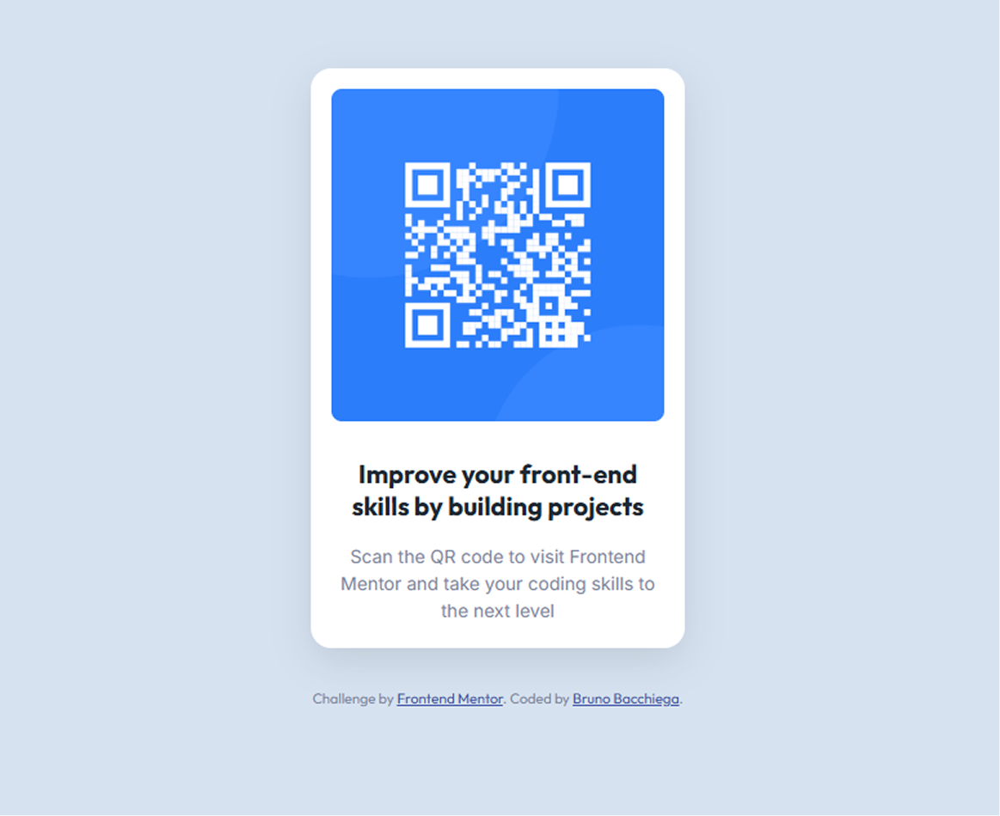

# Frontend Mentor - QR code component solution

This is a solution to the [QR code component challenge on Frontend Mentor](https://www.frontendmentor.io/challenges/qr-code-component-iux_sIO_H). Frontend Mentor challenges help you improve your coding skills by building realistic projects. 

## Table of contents

- [Overview](#overview)
  - [Screenshot](#screenshot)
  - [Links](#links)
- [My process](#my-process)
  - [Built with](#built-with)
  - [What I learned](#what-i-learned)
  - [Continued development](#continued-development)
  - [Useful resources](#useful-resources)
  - [AI Collaboration](#ai-collaboration)
- [Author](#author)
- [Acknowledgments](#acknowledgments)

**Note: Delete this note and update the table of contents based on what sections you keep.**

## Overview

### Screenshot

## My process

### Built with

- Semantic HTML5 markup
- CSS custom properties

### What I learned

With this project, I was able to deepen my understanding of some HTML and CSS concepts.

One of the areas I explored further was the information that comes by default inside the HTML <head> tag. It was something I previously understood only at a superficial level, and this project helped me gain a better understanding of its purpose and importance.

I also reinforced my knowledge of how to integrate Google Fonts into a project and how to properly define and apply font families and typography.

Another important aspect I practiced was organizing the HTML structure in a more hierarchical way. I spent time thinking about which elements should be nested inside others and which semantic structure made the most sense for each part of the component.

In addition, I studied the differences between using IDs and classes. For this specific project, I concluded that using IDs to identify some of the container elements made more sense than using classes, considering the simplicity of the component and the fact that those elements were unique within the page.

Regarding CSS, I learned and practiced properties that I had not used before, such as box shadows. I also worked more with margins and spacing, ensuring that the text and other elements were positioned consistently and matched the visual design provided in the challenge.

Overall, this project helped me strengthen my HTML and CSS fundamentals while paying closer attention to structure, organization, spacing, and visual details.

### Continued development

I want to deepen my knowledge of responsive design, ensuring that the components and every front-end application I build in the future are fully responsive and do not break across any type of device.

### AI Collaboration

I used Copilot through my personal account, and working alongside this AI was essential for me. First, I built the front-end based on what I believed was the most appropriate approach. After that, I exchanged ideas and suggestions with the AI to identify possible improvements and more efficient solutions. Additionally, there were some lines of HTML code that came as part of the project's default structure and that I did not fully understand. Copilot helped me understand the purpose and functionality of those code snippets.

## Author

- Product designer - [Bruno Bacchiega Gonçalves]
- Frontend Mentor - [BrunoBacchiega](https://www.frontendmentor.io/profile/BrunoBacchiega)

